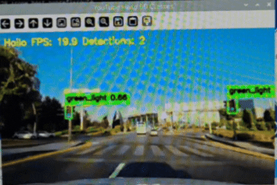
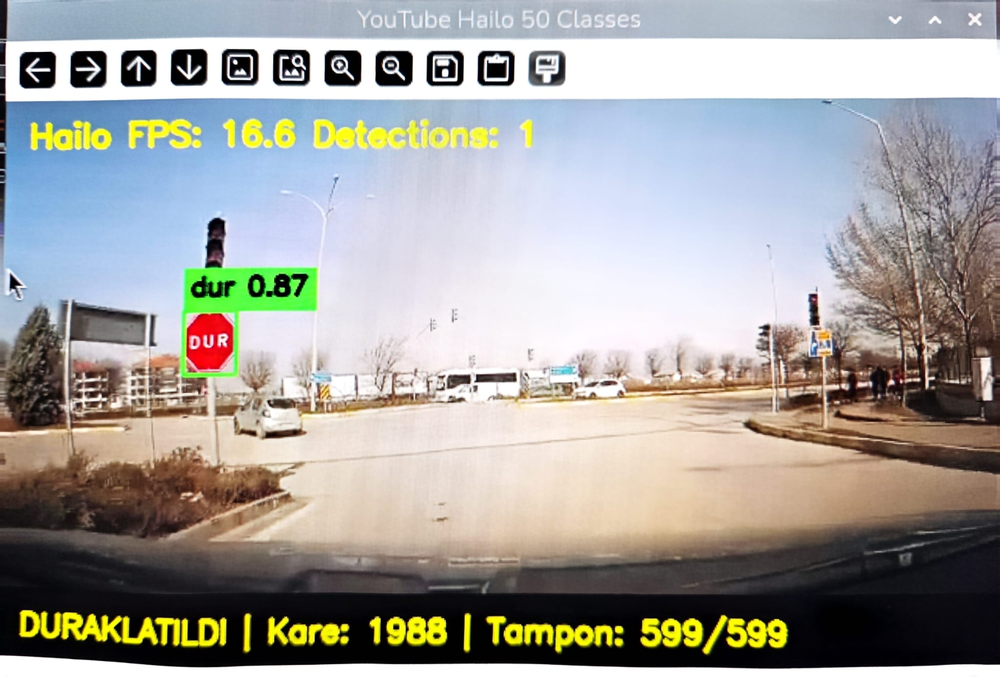
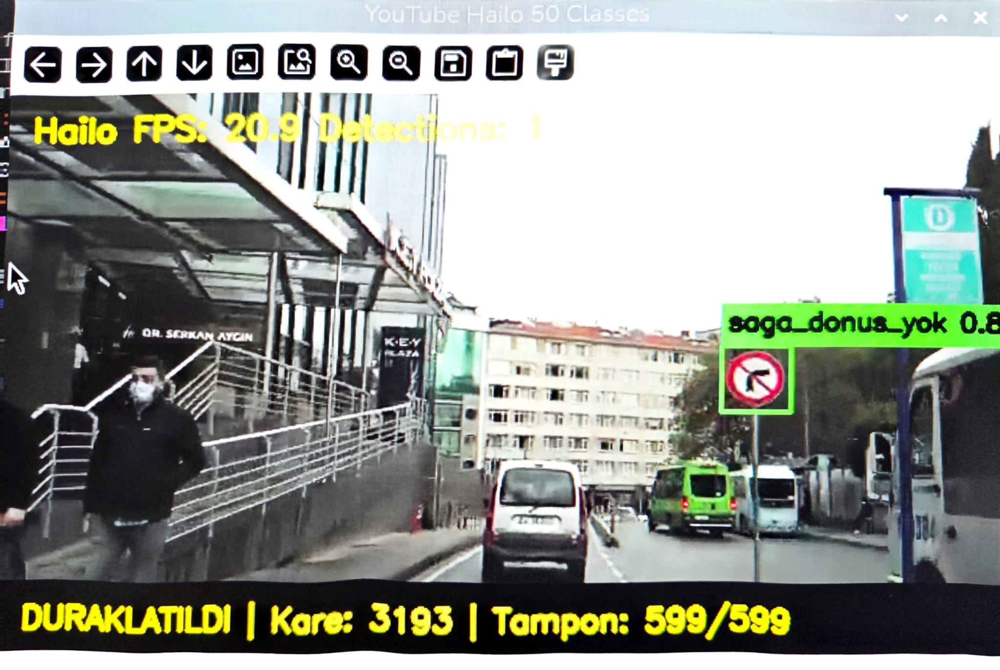
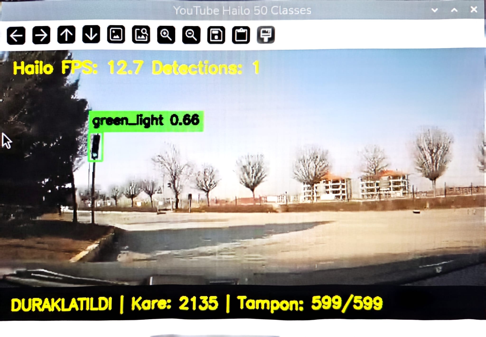
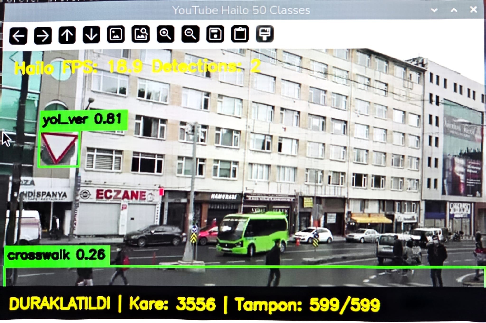

<h1 align="center">🚦 Traffic Sign Detection with Raspberry Pi 5 + Hailo-8L</h1>

<p align="center">
  Real-Time Traffic Sign, Traffic Light and Crosswalk Detection using YOLO and Hailo-8L AI Accelerator
</p>

<p align="center">
  
</p>

<p align="center">
  
  
  
  
  
  
</p>

---


<p align="center">
  
</p>


# 📌 Overview

This project implements a **real-time traffic perception system** on **Raspberry Pi 5** using the **Hailo-8L AI Accelerator**. A YOLO-based object detection model is trained, optimized, compiled into **HEF** format, and deployed for high-performance edge inference.

The system detects:

- 🚦 Traffic Signs
- 🚥 Traffic Lights
- 🚶 Crosswalks

from video streams or live camera input with low latency.

---

# ✨ Features

- Real-time object detection
- Raspberry Pi 5 deployment
- Hailo-8L hardware acceleration
- YOLO-based detection
- HEF optimized model
- Video inference
- Live camera inference
- OpenCV visualization

---

# 🛠️ Hardware

- Raspberry Pi 5
- Hailo-8L AI Accelerator
- USB Camera / Video Input

---

# 💻 Software

- Python 3.10
- Ultralytics YOLO
- OpenCV
- HailoRT
- Hailo Dataflow Compiler
- Ubuntu

---

# 📂 Project Structure

```text
traffic-sign-detection-hailo
│
├── assets/
│   └── demo.gif
│
├── models/
│
├── src/
│
├── videos/
│
├── README.md
│
└── requirements.txt
```

---

# 🚀 Pipeline

```
Dataset
    │
    ▼
YOLO Training
    │
    ▼
Export ONNX
    │
    ▼
Hailo Parse
    │
    ▼
Optimize
    │
    ▼
Compile (.hef)
    │
    ▼
Raspberry Pi 5
    │
    ▼
Real-Time Detection
```

---

# 📸 Demo

The GIF at the top of this page shows the model running in real time on Raspberry Pi 5 with the Hailo-8L accelerator.

---

# 📈 Performance

- Edge AI Inference
- Low Latency
- Real-Time Detection
- Optimized HEF Model

---

# 👩‍💻 Author

**Edanur Erol**

Computer Engineering Student

Karadeniz Technical University


<h1 align="center">🚦 Traffic Sign Detection with Raspberry Pi 5 + Hailo-8L</h1>

<p align="center">
  Real-Time Traffic Sign, Traffic Light and Crosswalk Detection using YOLO and Hailo-8L AI Accelerator
</p>

<p align="center">
  
</p>

<p align="center">
  
  
  
  
  
  
</p>

---

## 📌 Project Overview

This project performs **real-time traffic sign, traffic light, and crosswalk detection** on a **Raspberry Pi 5** using the **Hailo-8L AI Accelerator**. A YOLO-based object detection model is optimized and compiled into the **HEF** format, enabling efficient edge inference with low latency and high performance.

### Features

- 🚦 Real-time traffic sign detection
- 🚥 Traffic light recognition
- 🚶 Crosswalk detection
- ⚡ Hailo-8L hardware acceleration
- 🍓 Raspberry Pi 5 deployment
- 🎥 Video and live camera inference
- 📊 Optimized HEF model for edge AI

## 🛠️ Technologies

- Python
- YOLO (Ultralytics)
- OpenCV
- Hailo Dataflow Compiler
- HailoRT
- Raspberry Pi 5
- Hailo-8L


# Turkish Traffic Detection with YOLO and Hailo

<p align="center">
  
</p>


Real-time Turkish traffic sign, traffic light, and road-object detection system running on **Raspberry Pi** using **YOLO11** accelerated with a **Hailo-8L AI Accelerator**.

---

# Table of Contents

* Project Overview
* Features
* Hardware
* Technologies
* Installation
* Project Structure
* Model Information
* Running the Project
* Performance
* Supported Classes
* Dataset and Training
* Future Improvements
* Demo
* License
* Author

---

# Project Overview

This project performs real-time object detection on YouTube videos and live streams using a Raspberry Pi and a Hailo AI accelerator.

A trained YOLO11 model was converted into the Hailo HEF format and optimized for hardware acceleration. The system detects Turkish traffic signs, traffic lights, pedestrian crossings, and other road-related objects in real time.

---

# Features

* Real-time inference with Hailo acceleration
* Optimized HEF model for Hailo-8L
* YouTube video and live stream support
* 50 traffic-related object classes
* Turkish traffic sign detection
* Traffic light detection (Red / Yellow / Green)
* Pedestrian crossing detection
* Confidence threshold filtering
* Non-Maximum Suppression (NMS)
* Detection screenshots for manual review
* Configurable post-processing pipeline

---

# Hardware

* Raspberry Pi
* Hailo-8 / Hailo-8L AI Accelerator
* HailoRT
* Linux Operating System

---

# Technologies

* Python
* YOLO11
* HailoRT
* OpenCV
* NumPy
* FFmpeg
* yt-dlp

---

# Installation

Clone the repository:

```bash
git clone https://github.com/edanurerol/traffic-sign-detection-hailo.git
cd traffic-sign-detection-hailo
```

Activate your Python environment:

```bash
source ~/hailo_env/bin/activate
```

Install required Python packages:

```bash
pip install opencv-python numpy yt-dlp
```

Make sure the following software is already installed:

* HailoRT
* FFmpeg
* yt-dlp

Verify that the Hailo device is detected:

```bash
hailortcli scan
```

---

# Project Structure

```text
.
├── README.md
├── docs/
│   └── screenshots/
│       ├── image1.jpeg
│       ├── image2.jpeg
│       ├── image3.jpeg
│       └── image4.jpeg
│
├── models/
│   ├── class_names.txt
│   └── traffic_yolo11n_50classes_6heads_normalized_logits.hef
│
└── src/
    ├── config_50classes_normalized_logits.py
    ├── hailo_inference.py
    ├── postprocess_50classes_normalized_logits.py
    └── run_youtube_50classes_live_strict_v3.py
```

---

# Main Files

### `run_youtube_50classes_live_strict_v3.py`

Main application for YouTube stream processing and real-time inference.

### `hailo_inference.py`

Communicates with the Hailo accelerator and performs model inference.

### `postprocess_50classes_normalized_logits.py`

Processes YOLO outputs, applies confidence filtering, and performs Non-Maximum Suppression.

### `config_50classes_normalized_logits.py`

Contains model configuration, input/output information, and post-processing settings.

### `class_names.txt`

Contains the names of all detectable classes.

---

# Model Information

| Property         | Value     |
| ---------------- | --------- |
| Model            | YOLO11n   |
| Format           | HEF       |
| Classes          | 50        |
| Input Resolution | 640 × 640 |
| Accelerator      | Hailo-8L  |

Compiled model included in this repository:

```text
models/traffic_yolo11n_50classes_6heads_normalized_logits.hef
```

---

# Running the Project

Navigate to the project directory:

```bash
cd /home/pi/hailo_traffic/final_backup
```

Activate the environment:

```bash
source ~/hailo_env/bin/activate
```

Run the application:

```bash
python3 src/run_youtube_50classes_live_strict_v3.py
```

When prompted, enter a YouTube video or live stream URL.

---

# Performance

Test platform:

| Component         | Specification |
| ----------------- | ------------- |
| Platform          | Raspberry Pi  |
| AI Accelerator    | Hailo-8L      |
| Model             | YOLO11n (HEF) |
| Input Resolution  | 640 × 640     |
| Number of Classes | 50            |

Current capabilities:

| Feature                       | Status |
| ----------------------------- | ------ |
| Traffic Sign Detection        | ✅      |
| Traffic Light Detection       | ✅      |
| Pedestrian Crossing Detection | ✅      |
| YouTube Stream Support        | ✅      |
| Hailo Hardware Acceleration   | ✅      |

Performance depends on:

* Input video quality
* Scene complexity
* Object distance
* Lighting conditions
* Motion blur
* Number of visible objects

The Hailo accelerator enables efficient real-time inference while significantly reducing CPU workload.

---

# Supported Classes

The model detects 50 traffic-related classes including:

* Speed limit signs
* Stop sign
* No entry
* Parking signs
* Mandatory direction signs
* Warning signs
* Traffic lights
* Pedestrian crossings
* Road hazard signs
* Other Turkish traffic signs

---

# Dataset and Training

The project uses a custom dataset containing Turkish traffic signs, traffic lights, pedestrian crossings, and other road-related objects.

The dataset was cleaned, merged, balanced, and split into training, validation, and test sets before training.

Training resolution:

**640 × 640**

---

# Future Improvements

* Improve traffic sign dataset quality
* Add more real Turkish road images
* Balance underrepresented classes
* Reduce false-positive detections
* Improve small-object detection
* Add object tracking
* Support live camera input
* Develop a graphical user interface
* Publish benchmark results

---

# Demo

## Traffic Sign Detection




## Traffic Light Detection



## Pedestrian Crossing Detection



---

# License

This project is licensed under the **MIT License**.

The included model and dataset should be used according to their respective licenses.

---

# Author

**Edanur Erol**
**Rumeysa Leyla Demir**
Computer Engineering Student

**AI • Computer Vision • Embedded AI • Hailo**
